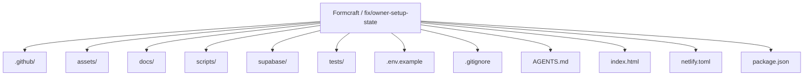
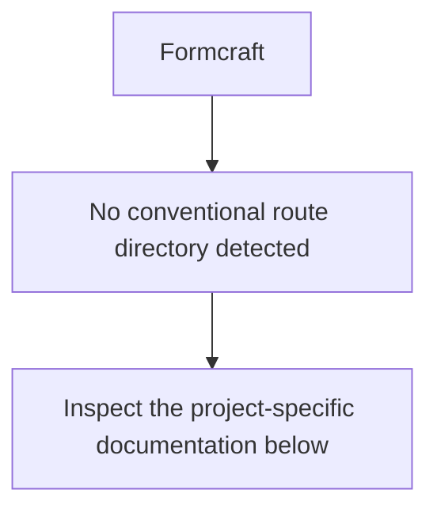
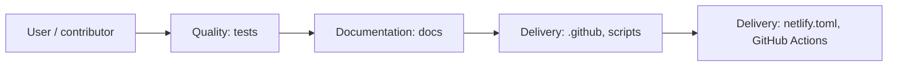
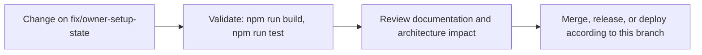

# Formcraft

<!-- interactive-readme-standard:start -->

> [!NOTE]
> **Branch-specific documentation:** this section is maintained for [`fix/owner-setup-state`](https://github.com/Nischhalsubba/Formcraft/tree/fix/owner-setup-state). It is generated from the files present on this branch and preserves the project-authored README below.

<details open>
<summary><strong>Interactive repository guide</strong></summary>

## Branch overview

| Item | Value |
|---|---|
| Repository | [`Nischhalsubba/Formcraft`](https://github.com/Nischhalsubba/Formcraft) |
| Branch | [`fix/owner-setup-state`](https://github.com/Nischhalsubba/Formcraft/tree/fix/owner-setup-state) |
| Detected stack | JavaScript, CSS, HTML, Python, TypeScript |
| Detected manifests | package.json |
| Documentation policy | Every maintained branch must explain purpose, setup, structure, architecture, flows, testing, delivery, security, and ownership. |

## Repository structure



The diagram is generated from the branch's actual top-level files and directories. Use the branch link above for complete source navigation.

## Website or application structure



## Application and responsibility flow



## Change-to-delivery flow



## README requirements for this branch

- Explain what this branch contains and how it differs from the default branch.
- Keep installation, configuration, usage, testing, deployment, security, support, and license information accurate.
- Document repository, website or application, API, data, authentication, background-job, and deployment flows when they exist.
- Prefer Mermaid diagrams and expandable `<details>` sections for visual navigation.
- Link diagrams and modules to real source paths; never invent missing components.
- Preserve project-specific documentation and update diagrams whenever architecture or major paths change.
- Treat secrets, private infrastructure, customer data, and credentials as prohibited README content.

</details>

<!-- interactive-readme-standard:end -->

Formcraft is an authenticated, multi-user admin workspace for projects, tasks, communication, files, invoices, reporting, and administration.

> A focused operating system for real workspace data, not a static dashboard demo.

## Current architecture

- **Frontend:** semantic HTML, CSS, and JavaScript
- **Hosting:** Netlify
- **Database:** Supabase Postgres
- **Authentication:** Supabase Auth
- **File storage:** private Supabase Storage bucket
- **Realtime:** Postgres changes on versioned workspace state
- **Security:** Row-Level Security, tenant membership, and role checks
- **Invitations:** authenticated Supabase Edge Function
- **Testing:** static architecture assertions and authenticated Chromium smoke tests

## Dynamic-data contract

Production Formcraft contains no seeded projects, tasks, people, messages, events, files, invoices, metrics, or activity.

A new workspace begins empty. Every number on the dashboard is calculated from the authenticated workspace, and every supported mutation is persisted remotely.

Browser storage is not the source of business data. The generated runtime configuration contains only the public Supabase URL and publishable key. Service-role credentials remain server-side.

## Functional modules

- Dashboard metrics and activity visualization
- Project CRUD, filtering, sorting, views, progress, and deadlines
- Task CRUD, priorities, statuses, completion, and project links
- Team roles and invitation flow
- Period-based reports generated from workspace data
- Calendar event CRUD and responsive agenda view
- Internal workspace mailbox with drafts, folders, batch actions, and cloud attachments
- Private file manager with folders, uploads, downloads, rename, star, and deletion
- Invoice CRUD, filters, statuses, duplication, payment updates, print, and export
- Activity history
- Workspace, notification, theme, currency, and data settings
- Global search and contextual create actions
- Desktop, tablet, and mobile navigation
- Light and dark themes

## Backend model

The first dynamic release stores the complete working application state in a versioned `workspace_state` JSONB record. This converts every existing module to authenticated remote persistence without maintaining two competing front-end state systems.

Supporting relational tables provide:

- profiles
- workspaces
- workspace members
- invitations
- activity logs
- private file policies

High-value domains can later be normalized behind the same runtime interface without changing the visual application.

See [`docs/DYNAMIC_ARCHITECTURE.md`](docs/DYNAMIC_ARCHITECTURE.md).

## Supabase setup

Create a dedicated Supabase project, then apply the migrations in order:

```text
supabase/migrations/20260730030000_formcraft_dynamic_backend.sql
supabase/migrations/20260730030100_invitation_activation.sql
```

Deploy the authenticated invitation function:

```text
supabase/functions/invite-member/
```

The migration creates:

- tenant tables and indexes
- workspace bootstrap and optimistic-update RPC functions
- Row-Level Security policies
- private Storage bucket policies
- realtime publication
- invitation activation behavior

## Netlify environment

Configure these environment variables:

```text
SUPABASE_URL
SUPABASE_PUBLISHABLE_KEY
```

Netlify runs:

```bash
npm run build
```

This creates `assets/js/runtime-config.js`, which is ignored by Git and served with `Cache-Control: no-store`.

## Local development

Create a local runtime config from environment variables:

```bash
SUPABASE_URL="https://your-project.supabase.co" \
SUPABASE_PUBLISHABLE_KEY="sb_publishable_..." \
npm run build
```

Then serve the repository:

```bash
python3 -m http.server 8080
```

Open `http://localhost:8080`.

## Verification

```bash
npm run test:syntax
npm test
python tests/browser-smoke.py
```

The browser test uses a test-only authenticated Supabase fixture. No test fixture is loaded in production.

## Design system

Formcraft uses the merged Maven-inspired visual system with rounded operational cards, strong numerical hierarchy, contextual actions, responsive bottom navigation, light/dark themes, and accessible interaction states.

See [`docs/MAVEN_DESIGN_SYSTEM.md`](docs/MAVEN_DESIGN_SYSTEM.md).

## Authorship

Product design and development by **Nischhal Raj Subba**.

Third-party dependencies retain their required attribution and licensing. Purchased template source and proprietary bundled assets are not redistributed unless their license explicitly permits it.
