<!-- interactive-readme-standard:start -->

<div align="center">

# Formcraft

**Branch-aware technical guide for [`agent/tour-centering-fix`](https://github.com/Nischhalsubba/Formcraft/tree/agent/tour-centering-fix)**

<p>      </p>

<p>
  <a href="https://github.com/Nischhalsubba/Formcraft/tree/agent/tour-centering-fix"><strong>Browse source</strong></a> ·
  <a href="https://github.com/Nischhalsubba/Formcraft/issues"><strong>Issues</strong></a> ·
  <a href="https://github.com/Nischhalsubba/Formcraft/codespaces/new?ref=agent%2Ftour-centering-fix"><strong>Open in Codespaces</strong></a>
</p>

</div>

> [!IMPORTANT]
> This guide is generated from the files actually present on `agent/tour-centering-fix`. It links to detected source paths, preserves project-authored notes, and avoids claiming components that were not found.

## At a glance

| Item | Detected value |
|---|---|
| Purpose | A JavaScript project documented from the current branch structure and manifests. |
| Branch role | Compared with `main` |
| Stack | JavaScript, CSS, Python, HTML, TypeScript |
| Manifests | package.json |
| Prerequisites | Node.js |
| Delivery | netlify.toml, GitHub Actions |
| License | No license file detected |

## Branch scope

This branch differs from the default branch in the following detected paths:

- [`README.md`](https://github.com/Nischhalsubba/Formcraft/blob/agent/tour-centering-fix/README.md)
- [`assets/css/workspace-enhancements.css`](https://github.com/Nischhalsubba/Formcraft/blob/agent/tour-centering-fix/assets/css/workspace-enhancements.css)
- [`tests/alignment-system-audit.mjs`](https://github.com/Nischhalsubba/Formcraft/blob/agent/tour-centering-fix/tests/alignment-system-audit.mjs)

## Quick start

```bash
npm install
npm run build
npm run test
```

### Configuration surface

- `.env.example`

> Never commit secrets, private keys, production credentials, customer data, or unredacted infrastructure details.

## Repository map

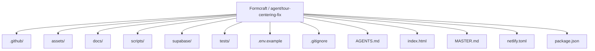

| Responsibility | Detected source paths |
|---|---|
| Data | [`supabase`](https://github.com/Nischhalsubba/Formcraft/tree/agent/tour-centering-fix/supabase) |
| Quality | [`tests`](https://github.com/Nischhalsubba/Formcraft/tree/agent/tour-centering-fix/tests) |
| Documentation | [`docs`](https://github.com/Nischhalsubba/Formcraft/tree/agent/tour-centering-fix/docs) |
| Delivery | [`.github`](https://github.com/Nischhalsubba/Formcraft/tree/agent/tour-centering-fix/.github), [`scripts`](https://github.com/Nischhalsubba/Formcraft/tree/agent/tour-centering-fix/scripts) |

## Website or application map

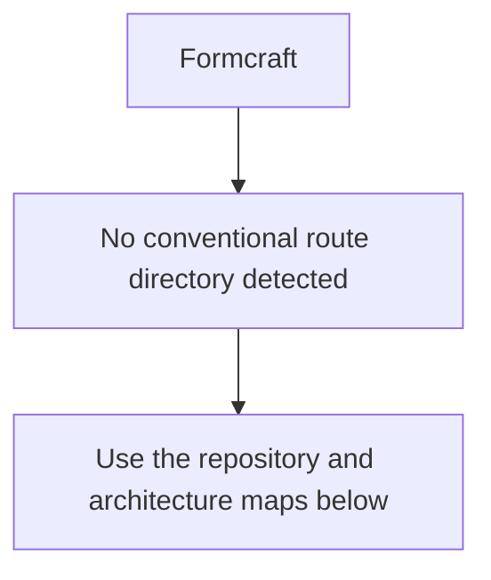

## Architecture and responsibility flow

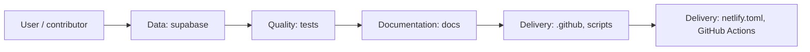

<details>
<summary><strong>Authentication and authorization flow</strong></summary>

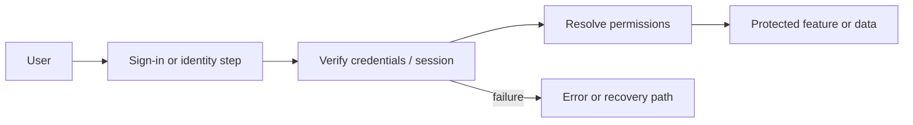

Relevant detected files: [`assets/js/auth-onboarding.js`](https://github.com/Nischhalsubba/Formcraft/blob/agent/tour-centering-fix/assets/js/auth-onboarding.js).

> The diagram expresses the responsibility sequence only. Confirm exact providers, token formats, roles, and recovery behavior in the linked source.

</details>
<details>
<summary><strong>Data flow and model surface</strong></summary>

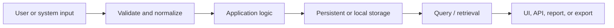

Detected data areas: [`supabase`](https://github.com/Nischhalsubba/Formcraft/tree/agent/tour-centering-fix/supabase), [`supabase/migrations/20260802170000_erp_relational_foundation.sql`](https://github.com/Nischhalsubba/Formcraft/blob/agent/tour-centering-fix/supabase/migrations/20260802170000_erp_relational_foundation.sql), [`supabase/migrations/20260730030000_formcraft_dynamic_backend.sql`](https://github.com/Nischhalsubba/Formcraft/blob/agent/tour-centering-fix/supabase/migrations/20260730030000_formcraft_dynamic_backend.sql), [`supabase/migrations/20260802174000_nepal_invoice_sequence_and_outbox.sql`](https://github.com/Nischhalsubba/Formcraft/blob/agent/tour-centering-fix/supabase/migrations/20260802174000_nepal_invoice_sequence_and_outbox.sql), [`supabase/migrations/20260730043000_installation_owner_state.sql`](https://github.com/Nischhalsubba/Formcraft/blob/agent/tour-centering-fix/supabase/migrations/20260730043000_installation_owner_state.sql), [`supabase/migrations/20260730030100_invitation_activation.sql`](https://github.com/Nischhalsubba/Formcraft/blob/agent/tour-centering-fix/supabase/migrations/20260730030100_invitation_activation.sql), [`supabase/functions/invite-member/deno.json`](https://github.com/Nischhalsubba/Formcraft/blob/agent/tour-centering-fix/supabase/functions/invite-member/deno.json), [`supabase/functions/invite-member/index.ts`](https://github.com/Nischhalsubba/Formcraft/blob/agent/tour-centering-fix/supabase/functions/invite-member/index.ts), [`tests/supabase-browser-mock.js`](https://github.com/Nischhalsubba/Formcraft/blob/agent/tour-centering-fix/tests/supabase-browser-mock.js).

</details>

## Quality, security, and operations

<table>
<tr>
<td width="33%" valign="top">

### Quality

- [`tests`](https://github.com/Nischhalsubba/Formcraft/tree/agent/tour-centering-fix/tests)

Detected commands:
- `npm run build`
- `npm run test`

</td>
<td width="33%" valign="top">

### Security

- No dedicated security policy or automated dependency configuration was detected.

Review authentication, authorization, input validation, dependency updates, secret handling, and failure recovery before release.

</td>
<td width="34%" valign="top">

### Observability

- No dedicated observability integration was detected automatically.

Define useful logs, metrics, traces, alerts, and rollback signals for production-facing branches.

</td>
</tr>
</table>

## Delivery flow

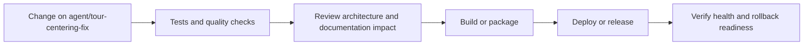

### Automation detected

- [`.github/workflows/apply-interactive-readme.yml`](https://github.com/Nischhalsubba/Formcraft/blob/agent/tour-centering-fix/.github/workflows/apply-interactive-readme.yml)
- [`.github/workflows/erp-suite-browser-validation.yml`](https://github.com/Nischhalsubba/Formcraft/blob/agent/tour-centering-fix/.github/workflows/erp-suite-browser-validation.yml)
- [`.github/workflows/interaction-audit.yml`](https://github.com/Nischhalsubba/Formcraft/blob/agent/tour-centering-fix/.github/workflows/interaction-audit.yml)
- [`.github/workflows/record-workspace-validation.yml`](https://github.com/Nischhalsubba/Formcraft/blob/agent/tour-centering-fix/.github/workflows/record-workspace-validation.yml)
- [`.github/workflows/ui-audit.yml`](https://github.com/Nischhalsubba/Formcraft/blob/agent/tour-centering-fix/.github/workflows/ui-audit.yml)
- [`.github/workflows/worldclass-ui-audit.yml`](https://github.com/Nischhalsubba/Formcraft/blob/agent/tour-centering-fix/.github/workflows/worldclass-ui-audit.yml)

## Contribution flow

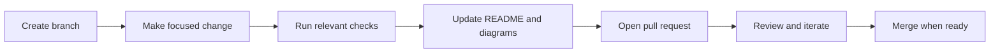

- Keep changes focused and explain architectural consequences.
- Run the checks relevant to the changed area.
- Update diagrams whenever routes, modules, data models, authentication, jobs, or delivery paths change.
- Add screenshots or recordings for visual behavior changes when useful.
- Use issues for reproducible defects and pull requests for reviewable changes.

## Ownership and support

| Topic | Source |
|---|---|
| Repository | [`Nischhalsubba/Formcraft`](https://github.com/Nischhalsubba/Formcraft) |
| Branch | [`agent/tour-centering-fix`](https://github.com/Nischhalsubba/Formcraft/tree/agent/tour-centering-fix) |
| Ownership | No CODEOWNERS file detected |
| Contributing | Use the contribution flow above |
| Support | [Open or review issues](https://github.com/Nischhalsubba/Formcraft/issues) |
| License | No license file detected |

<details>
<summary><strong>Documentation maintenance checklist</strong></summary>

- [ ] Purpose and branch scope are accurate.
- [ ] Setup and configuration commands still work.
- [ ] Repository, application, API, data, authentication, job, and deployment diagrams match the code.
- [ ] Tests, security controls, observability, and rollback behavior are documented.
- [ ] Links point to real files on this branch.
- [ ] No secrets or private operational details are exposed.

</details>

<!-- interactive-readme-standard:end -->

<!-- project-authored-notes:start -->
<details>
<summary><strong>Project-authored notes preserved from this branch</strong></summary>

# Formcraft

Formcraft is a Nepal-first, authenticated business workspace that connects projects, Jira-style tasks, calendars, files, communication, invoicing, customer work, finance foundations, operations, people, and reporting through one shared application shell.

> The product goal is not “many pages in a sidebar.” The goal is one understandable operating system where related records, actions, permissions, and reports share the same context.

## Contents

- [Product principles](#product-principles)
- [Architecture map](#architecture-map)
- [Runtime request flow](#runtime-request-flow)
- [Navigation model](#navigation-model)
- [Connected business flows](#connected-business-flows)
- [Design token studio](#design-token-studio)
- [Application modules](#application-modules)
- [Frontend architecture](#frontend-architecture)
- [Backend architecture](#backend-architecture)
- [Data model and persistence](#data-model-and-persistence)
- [Authentication and permissions](#authentication-and-permissions)
- [Nepal localization](#nepal-localization)
- [Responsive architecture](#responsive-architecture)
- [Testing and quality gates](#testing-and-quality-gates)
- [Local development](#local-development)
- [Supabase setup](#supabase-setup)
- [Netlify deployment](#netlify-deployment)
- [Repository structure](#repository-structure)
- [Known boundaries](#known-boundaries)

---

## Product principles

Formcraft follows six rules:

1. **Stable navigation**  
   The sidebar does not transform into a different menu whenever a user opens another app. Core destinations stay in the same position. The “All apps” launcher contains the broader catalogue.

2. **Records are pages, actions are dialogs**  
   Projects, tasks, customers, orders, employees, invoices, and other long-lived records use detail pages. Bounded creation, editing, comments, time entries, and confirmations use dialogs.

3. **One source of business state**  
   The application does not maintain competing demo, local, and cloud datasets. The authenticated workspace state is the source of truth for the current connected frontend.

4. **Modules communicate through relationships**  
   Tasks update projects. Time entries update project delivery and billable work. Invoices update commercial reporting. Customer and supplier records connect to sales, purchase, support, and finance workflows.

5. **Nepal is a first-class market**  
   Bikram Sambat dates, Nepal fiscal years, NPR, PAN, VAT, TDS foundations, NRB exchange-rate support, and IRD/CBMS architecture are product concerns rather than decorative localization.

6. **Design is token-driven**  
   Workspace owners and administrators can control the shared palette, typography, spacing, density, control sizes, content width, radius, shadows, motion, and sidebar shortcuts without editing CSS.

---

# Architecture map

The diagram below is the primary map of the application. GitHub renders it as Mermaid. Nodes with `click` rules open the related section when Mermaid link interaction is supported by the viewer.

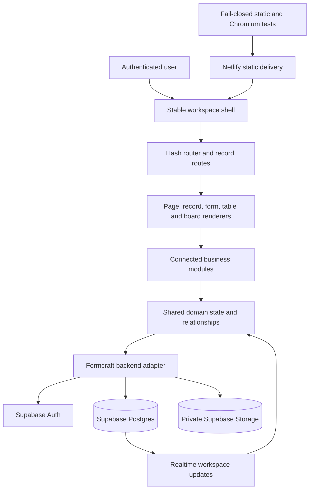

### Layer responsibilities

| Layer | Responsibility |
|---|---|
| Stable workspace shell | Navigation, search, company/branch context, account controls, responsive drawer, and mobile bottom navigation |
| Router | Page routes, ERP app routes, project/task record routes, browser history, and deep links |
| Renderers | Lists, boards, dashboards, forms, detail records, reports, calendars, email, files, and invoices |
| Module workflows | State transitions and cross-module actions such as quotation → order → invoice |
| Domain state | Projects, tasks, contacts, ERP records, invoices, events, files, comments, time, relationships, and settings |
| Backend adapter | Authentication, workspace bootstrap, optimistic updates, realtime subscriptions, storage, and invitations |
| Database and storage | Tenant data, versioned workspace state, relational support tables, audit records, and private file objects |
| Quality gates | Syntax, static contracts, model tests, responsive checks, and authenticated Chromium regression suites |

---

# Runtime request flow

This flow describes what happens after a user performs an action such as completing a task, confirming a sales order, or changing the workspace theme.

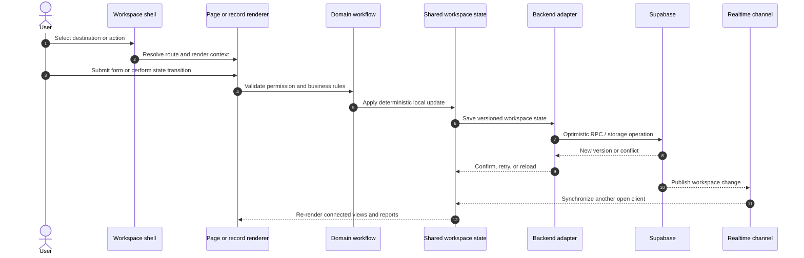

### Example: task completion

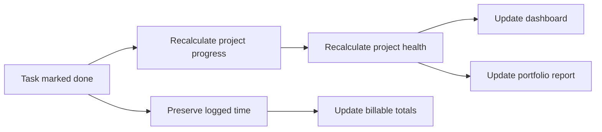

### Example: commercial workflow

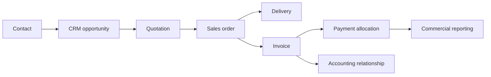

---

# Navigation model

The workspace uses **one stable sidebar**, not a global rail plus a sidebar that changes its entire structure on every route.

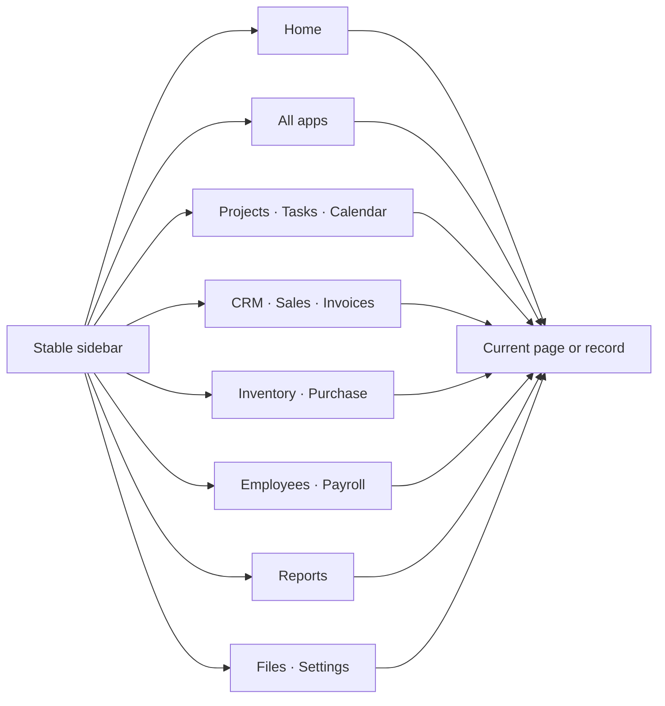

### Desktop

- One fixed sidebar contains core workspace destinations and selected business shortcuts.
- The current destination changes its active state, but the item order and section structure remain stable.
- “All apps” opens the full application catalogue.
- The top bar provides search, context, creation, notifications, and the account menu.
- Long-lived records open in the main content region.

### Tablet

- The same stable sidebar becomes an overlay.
- The underlying page keeps its position and width.
- Escape, outside click, or destination selection closes the overlay.

### Mobile

- A stable bottom navigation exposes Home, Apps, the current work area, Create, and More.
- More opens a drawer containing the same fixed navigation structure used on desktop.
- The drawer does not mutate into app-specific category navigation.

### Admin navigation control

Workspace owners and administrators can choose which optional shortcuts appear in the stable sidebar. Home, All apps, and Settings are mandatory so a creative administrator cannot accidentally design a maze with no exit.

---

# Connected business flows

## Project delivery

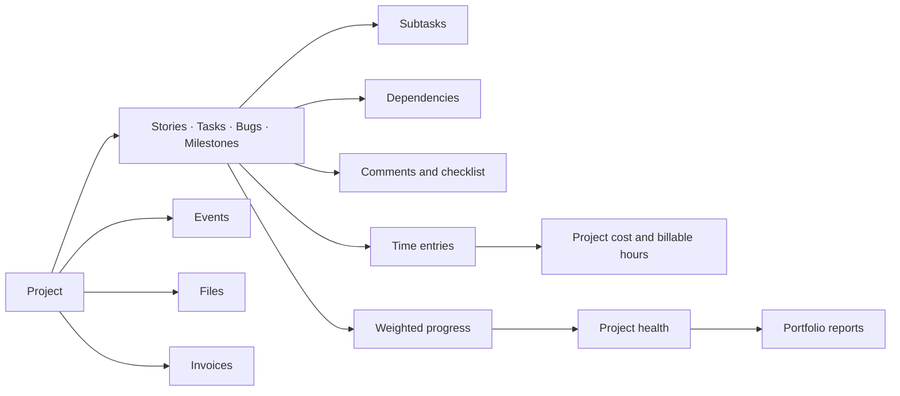

## Purchase and inventory

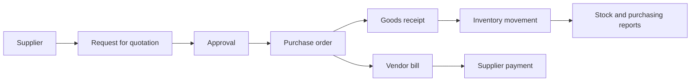

## Employee operations

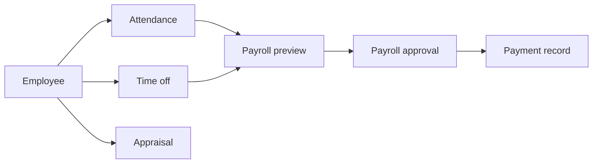

## Customer service

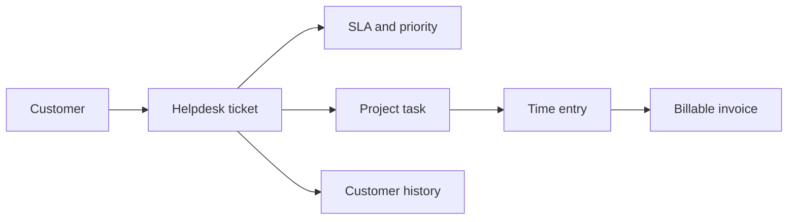

---

# Design token studio

Workspace owners and administrators can open:

```text
Settings → Interface
```

The studio edits semantic design tokens rather than individual selectors. This keeps the UI customizable without turning every screen into an unrelated theme experiment.

## Customizable tokens

| Area | Controls |
|---|---|
| Theme | System, light, or dark |
| Brand colors | Primary, success, warning, and danger |
| Light palette | Canvas, surface, text, muted text, and border |
| Dark palette | Canvas, surface, text, muted text, and border |
| Typography | Interface font, display font, base size, type scale, and line height |
| Density | Compact, comfortable, or spacious |
| Proximity | Global spacing scale and section gap |
| Components | Card padding, control height, radius, icon size, and shadow strength |
| Layout | Sidebar width and maximum content width |
| Motion | Standard or reduced motion |
| Navigation | Shared sidebar shortcuts and count visibility |

## Font choices

- Inter
- Manrope
- DM Sans
- IBM Plex Sans
- Source Sans 3
- System UI

## Theme lifecycle

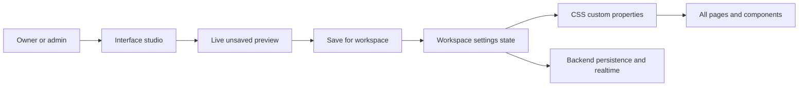

Themes can be exported and imported as JSON. Imported themes are previewed before they are saved.

---

# Application modules

Formcraft exposes a broad ERP application catalogue while retaining deeper first-class workspace modules.

## First-class connected modules

- Dashboard
- Projects
- Jira-style tasks
- Calendar and Bikram Sambat calendar
- Team and workspace access
- Reports
- Email workspace
- Private file manager
- Nepal invoicing and payments
- Activity history
- Settings, navigation, and interface studio

## ERP application catalogue

### Essentials

- Contacts
- Activities
- Approvals
- Automation
- Studio-like configuration foundation

### Finance

- Nepal invoicing
- Accounting foundation
- Expenses
- Payments

### Sales

- CRM
- Sales
- Point of Sale foundation
- Subscriptions
- Rental

### Websites

- Website
- eCommerce
- eLearning
- Forum
- Blog
- Live Chat

### Supply chain

- Purchase
- Inventory
- Barcode
- Manufacturing
- Quality
- Maintenance
- PLM
- Repairs

### Human resources

- Employees
- Attendance
- Time Off
- Recruitment
- Appraisals
- Payroll foundation
- Fleet
- Front Desk
- Referrals
- Lunch

### Marketing

- Email Marketing
- SMS Marketing
- Marketing Automation
- Events
- Marketing Cards
- Surveys

### Services

- Projects
- Timesheets
- Planning
- Field Service
- Helpdesk
- Appointments

### Productivity

- Documents
- Sign foundation
- Spreadsheet foundation
- Dashboards
- Knowledge
- Discuss
- Calendar
- Data Cleaning

A module appearing in the catalogue means the shared record surface and representative workflow exist. It does **not** imply one-to-one feature depth with mature specialist products. See [Known boundaries](#known-boundaries).

---

# Frontend architecture

Formcraft intentionally uses semantic HTML, CSS, and JavaScript rather than a compile-heavy frontend framework.

## Runtime composition

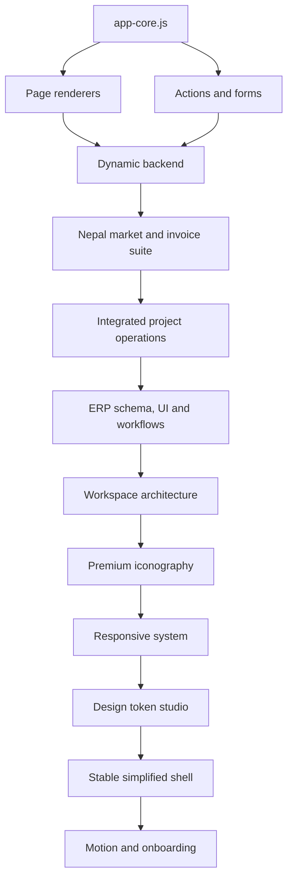

### Why the final layers wrap earlier layers

The repository evolved through several product generations. Later layers preserve working domain behavior while replacing navigation, visual hierarchy, responsiveness, or interaction contracts. The build therefore enforces script order and static contracts.

New work should prefer editing the current final layers rather than adding yet another override file. Human beings have already invented enough sedimentary CSS.

## Key frontend responsibilities

| File family | Responsibility |
|---|---|
| `app-core.js` | Shared state, routes, helpers, base icons, formatting, and empty workspace defaults |
| `app-pages.js` | Original workspace page renderers |
| `app-actions.js` / `app-modules.js` | Forms, actions, calendars, files, invoices, settings, and data operations |
| `dynamic-backend.js` | Authenticated state loading, saving, realtime, conflicts, and file adapter |
| `nepal-*` | Nepal localization, invoice calculations, compliance state, and BS date support |
| `integrated-operations-*` | Detailed projects, tasks, dependencies, time, relationships, and reports |
| `erp-suite-*` | Application schema, shared record surfaces, and cross-module workflows |
| `workspace-architecture-v3*` | Base shell and responsive navigation foundation |
| `premium-*` | Semantic iconography and visual hierarchy |
| `responsive-system-v2*` | Final viewport, table, board, form, calendar, and invoice responsiveness |
| `ui-theme-studio.*` | Admin-controlled design tokens and settings panels |
| `simplified-workspace-v4.*` | Stable navigation and simplified final layout |

---

# Backend architecture

Formcraft uses Supabase for authentication, Postgres persistence, realtime, functions, and private file storage.

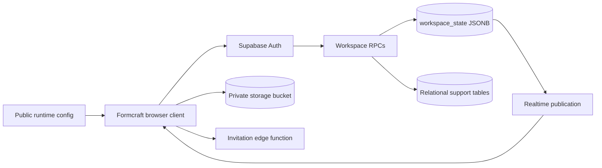

## Public versus secret configuration

The browser receives only:

```text
SUPABASE_URL
SUPABASE_PUBLISHABLE_KEY
```

Service-role credentials remain server-side. `assets/js/runtime-config.js` is generated during the build and served with `Cache-Control: no-store`.

---

# Data model and persistence

## Current shared-state model

The connected frontend persists its complete workspace state in a versioned `workspace_state` JSONB record. This provides:

- One authenticated source of truth
- Optimistic version checks
- Cross-module state updates
- Realtime synchronization
- No competing local demo dataset
- A migration path toward normalized domain tables

Supporting relational tables include workspace identity, membership, invitations, profiles, logs, files, invoice sequences, compliance outbox records, ERP records, links, events, approvals, automation jobs, and posting locks where migrations have been applied.

## Save lifecycle

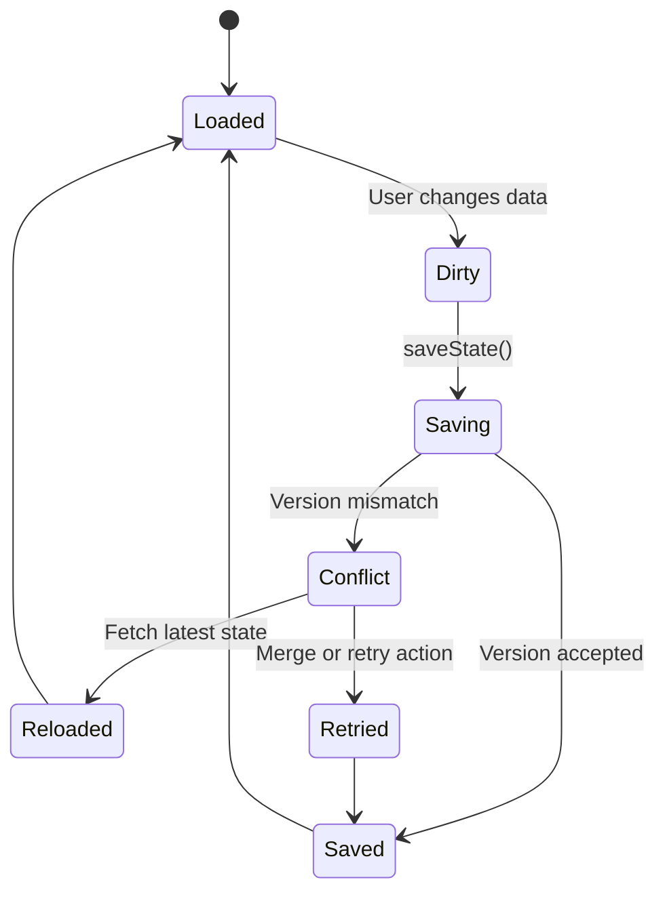

## Why some domains need normalization

The JSONB workspace model is appropriate for the current connected frontend foundation. It is not the final architecture for authoritative:

- Double-entry accounting
- Perpetual stock valuation
- Payroll posting
- Manufacturing costing
- Bank reconciliation
- POS offline synchronization

Those domains require transactional relational tables, immutable ledgers, lock dates, idempotency, reconciliation, and audited posting rules.

---

# Authentication and permissions

- Supabase Auth manages sessions.
- Workspace membership determines tenant access.
- Row-Level Security limits records to authorized workspaces.
- Roles include owner/admin, editor, and viewer-style access levels.
- Editing and workflow actions check role capability.
- Interface and navigation customization are restricted to workspace owners and administrators.
- Invitation creation uses an authenticated server-side function.
- Private files use storage policies rather than public URLs.

```mermaid
flowchart LR
    SESSION[Authenticated session] --> MEMBER{Workspace member?}
    MEMBER -- No --> DENY[Reject access]
    MEMBER -- Yes --> ROLE{Role capability}
    ROLE -- View --> READ[Read workspace]
    ROLE -- Edit --> MUTATE[Edit operational records]
    ROLE -- Admin --> ADMIN[Members, design, navigation and workspace settings]
```

---

# Nepal localization

Formcraft includes a Nepal-first product layer:

- Bikram Sambat date entry and display
- AD storage for stable sorting and interoperability
- Nepal fiscal-year awareness
- NPR-first commercial amounts
- PAN and VAT fields
- VAT-inclusive and VAT-exclusive calculations
- Taxable, exempt, and zero-rated invoice lines
- Credit and debit notes
- Payment and refund ledger
- NRB exchange-rate architecture
- Server-side invoice-number reservation
- Immutable issued-invoice snapshots
- CBMS preparation outbox
- Nepal employee PAN, SSF, PF, and CIT fields
- Nepal payroll-preview structure

## Invoice lifecycle

```mermaid
stateDiagram-v2
    [*] --> Draft
    Draft --> Validated
    Validated --> IssuedLocked
    IssuedLocked --> Sent
    Sent --> PartiallyPaid
    Sent --> Paid
    PartiallyPaid --> Paid
    IssuedLocked --> Adjusted: Credit or debit note
    IssuedLocked --> CBMSQueued: Applicable businesses
    CBMSQueued --> Submitted
    CBMSQueued --> Retry
```

IRD or CBMS certification is not implied merely because the technical preparation layer exists. Regulatory approval and current official integration requirements must be completed separately.

---

# Responsive architecture

The final responsive system defines explicit modes:

| Mode | Typical viewport |
|---|---|
| Compact | Up to 360 px |
| Phone | 361–520 px |
| Mobile | 521–820 px |
| Mobile landscape | Short landscape viewports up to 1000 px wide |
| Tablet | 821–1100 px |
| Desktop | 1101–1599 px |
| Wide | 1600 px and above |

## Responsive rules

- General ERP tables become labelled cards on phones.
- Dense Jira task tables remain horizontally scrollable.
- Kanban boards use viewport-sized horizontal columns.
- Calendars preserve seven readable columns and scroll when necessary.
- Legal invoice tables preserve required columns.
- Forms use visual-viewport height and 16 px mobile controls.
- Bottom-navigation height is measured and reserved dynamically.
- Tablet navigation uses an overlay rather than a crushed desktop sidebar.
- The stable sidebar becomes the same stable drawer on mobile.

---

# Testing and quality gates

Netlify runs `npm run build`. The build generates runtime configuration and then runs the full verification suite. A syntax or contract failure blocks deployment.

## Static and model checks

```bash
npm run test:syntax
npm run test:premium
npm run test:responsive
npm run test:shell
npm test
```

The tests cover:

- JavaScript syntax
- Navigation and interaction contracts
- Nepal market rules
- Nepal invoice rules
- BS calendar behavior
- Project/task relationships and calculations
- ERP application schema
- Workspace architecture
- Premium icon uniqueness
- Responsive layouts
- Stable sidebar behavior
- Admin design-token configuration
- README architecture documentation

## Authenticated Chromium suites

```bash
python tests/browser-smoke.py
python tests/erp-suite-browser-smoke.py
python tests/workspace-architecture-v3-browser-smoke.py
python tests/premium-interface-browser-smoke.py
python tests/responsive-system-browser-smoke.py
python tests/simplified-workspace-browser-smoke.py
```

The browser tests use a test-only Supabase fixture. Production does not load test data.

## Tested viewport matrix

- 320 × 800 compact phone
- 390 × 844 phone
- 768 × 1024 large mobile/small tablet
- 1024 × 768 tablet
- 844 × 390 phone landscape
- 1366 × 768 desktop
- 1536 × 960 wide desktop

---

# Local development

## Requirements

- Node.js 22 or compatible current LTS
- Python 3.12 for Chromium smoke tests
- A Supabase project for authenticated development

## Build runtime configuration

```bash
SUPABASE_URL="https://your-project.supabase.co" \
SUPABASE_PUBLISHABLE_KEY="sb_publishable_..." \
npm run build
```

## Serve locally

```bash
python3 -m http.server 8080
```

Open:

```text
http://localhost:8080
```

## Run Playwright browser dependencies

```bash
python -m pip install playwright==1.54.0
python -m playwright install chromium
```

---

# Supabase setup

Create a dedicated Supabase project and apply migrations in timestamp order from:

```text
supabase/migrations/
```

The migration history covers the dynamic workspace backend, invitation activation, Nepal invoice sequencing and compliance outbox, and ERP relational foundations.

Deploy the authenticated invitation function from:

```text
supabase/functions/invite-member/
```

Configure:

- Authentication providers and redirect URLs
- Row-Level Security policies
- Realtime publication
- Private storage bucket policies
- Edge Function environment values
- Required database functions and grants

Do not expose service-role credentials in the browser or Netlify public runtime configuration.

---

# Netlify deployment

Set these environment variables in Netlify:

```text
SUPABASE_URL
SUPABASE_PUBLISHABLE_KEY
```

Netlify runs:

```bash
npm run build
```

The build performs:

```mermaid
flowchart LR
    ENV[Netlify environment] --> CONFIG[Generate runtime-config.js]
    CONFIG --> SYNTAX[Syntax checks]
    SYNTAX --> CONTRACTS[Static and model contracts]
    CONTRACTS --> BUILD[Publish static site]
    BUILD --> PREVIEW[Deploy preview or production]
```

Pull requests receive isolated deploy previews. Production should be updated only after required GitHub checks and manual acceptance pass.

---

# Repository structure

```text
Formcraft/
├── .github/workflows/          GitHub Actions quality gates
├── assets/
│   ├── css/                    Component, architecture, responsive, and theme layers
│   └── js/                     Core, modules, backend, ERP, Nepal, shell, and settings runtimes
├── docs/                       Architecture, design, compliance, and UX audits
├── scripts/                    Runtime configuration build scripts
├── supabase/
│   ├── functions/              Authenticated server-side functions
│   └── migrations/             Postgres schema, policies, functions, and queues
├── tests/                      Static, model, and authenticated Chromium tests
├── index.html                  Script and stylesheet composition order
├── netlify.toml                Hosting, headers, and build configuration
├── package.json                Verification commands
└── README.md                   Product and architecture guide
```

---

# Known boundaries

Formcraft contains a connected ERP application foundation, but it does not claim mature one-to-one parity with every specialist feature of Odoo or another long-established ERP.

The following areas require dedicated transactional releases before they should be treated as authoritative production systems:

- Complete double-entry general ledger
- Bank reconciliation and financial closing
- Fixed assets and depreciation
- Perpetual inventory valuation and landed costs
- Full manufacturing costing and variance analysis
- Offline POS recovery and hardware integration
- Production eCommerce checkout and carrier integration
- Legally defensible electronic-signature evidence
- Collaborative spreadsheet engine
- Production email and SMS delivery infrastructure
- Fully validated Nepal payroll calculation
- IRD and CBMS approval or certification
- Unrestricted low-code server-action execution

The repository deliberately distinguishes “working connected application surface” from “complete regulated specialist domain.” Cheerful menu icons are not an accounting control.

---

## Authorship

Product design and development by **Nischhal Raj Subba**.

Third-party dependencies retain their required attribution and licensing. Odoo source code, proprietary assets, branded layouts, and icons are not copied into Formcraft.

</details>
<!-- project-authored-notes:end -->
