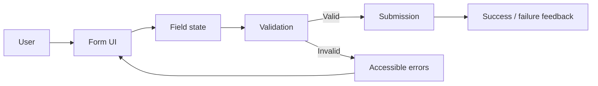
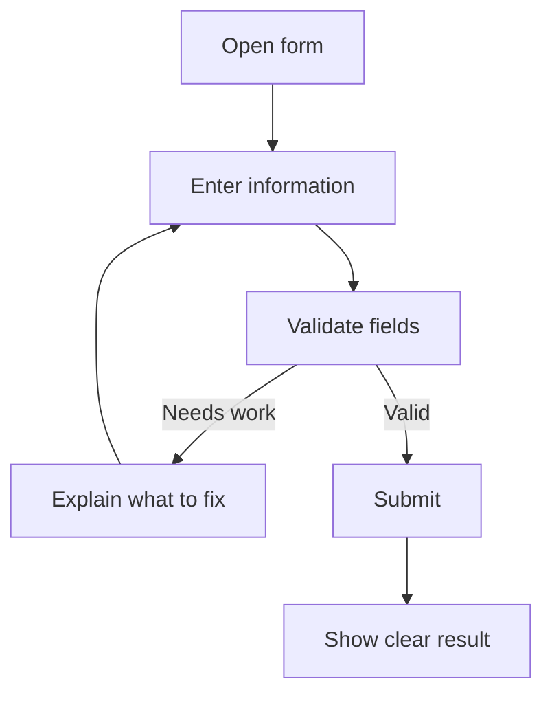
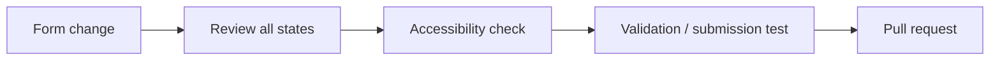

<div align="center">

# Formcraft

**A form-focused web project for creating clear input experiences, structured data capture, validation, and useful submission feedback.**


[Browse source](https://github.com/Nischhalsubba/Formcraft/tree/main) · [Issues](https://github.com/Nischhalsubba/Formcraft/issues)

</div>

## Overview

**Formcraft** is documented around the full form experience: what a person is asked to provide, how the interface validates it, how errors are explained, and what happens after submission. That makes the repository understandable beyond the source code itself.

| Audience | Focus |
|---|---|
| Users | Complete forms with clear guidance and feedback |
| Developers | Inputs, validation, state, submission and error handling |
| Designers | Field hierarchy, labels, states, mobile behavior and accessibility |
| Product teams | Required data, completion friction and success criteria |

<details open>
<summary><strong>🏗️ Interactive form architecture</strong></summary>



</details>

## Form flow



## Getting started

```bash
git clone https://github.com/Nischhalsubba/Formcraft.git
cd Formcraft
```

Use the package manager and scripts indicated by committed manifests/lockfiles.

## Design & accessibility

Every control should have a persistent label, useful instructions, keyboard access, visible focus, readable error messaging, programmatic error association, sensible input types/autocomplete, and a success state that explains what happened next.

## SEO & discoverability

Use accurate terms such as **form UI, form validation, accessible forms, web forms, form design, and data collection** naturally in public descriptions and documentation. Public pages should also maintain useful titles, descriptions, headings, canonical URLs and social metadata when applicable.

## Contribution flow


