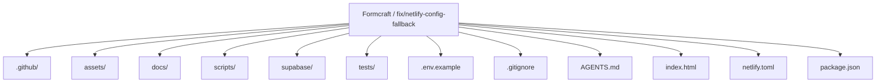
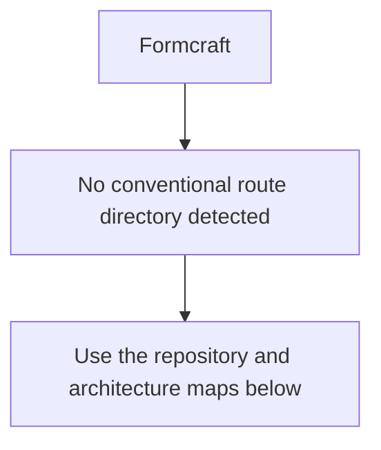
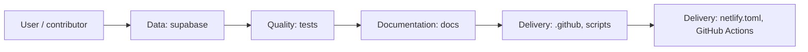
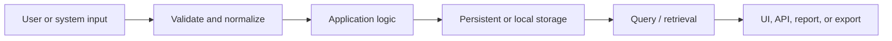
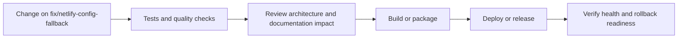
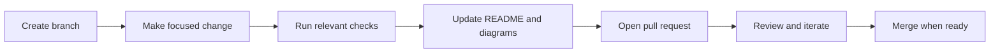

<!-- interactive-readme-standard:start -->

<div align="center">

# Formcraft

**Branch-aware technical guide for [`fix/netlify-config-fallback`](https://github.com/Nischhalsubba/Formcraft/tree/fix/netlify-config-fallback)**

<p>      </p>

<p>
  <a href="https://github.com/Nischhalsubba/Formcraft/tree/fix/netlify-config-fallback"><strong>Browse source</strong></a> ·
  <a href="https://github.com/Nischhalsubba/Formcraft/issues"><strong>Issues</strong></a> ·
  <a href="https://github.com/Nischhalsubba/Formcraft/codespaces/new?ref=fix%2Fnetlify-config-fallback"><strong>Open in Codespaces</strong></a>
</p>

</div>

> [!IMPORTANT]
> This guide is generated from the files actually present on `fix/netlify-config-fallback`. It links to detected source paths, preserves project-authored notes, and avoids claiming components that were not found.

## At a glance

| Item | Detected value |
|---|---|
| Purpose | A JavaScript project documented from the current branch structure and manifests. |
| Branch role | Compared with `main` |
| Stack | JavaScript, CSS, HTML, TypeScript, Python |
| Manifests | package.json |
| Prerequisites | Node.js |
| Delivery | netlify.toml, GitHub Actions |
| License | No license file detected |

## Branch scope

This branch differs from the default branch in the following detected paths:

- [`README.md`](https://github.com/Nischhalsubba/Formcraft/blob/fix/netlify-config-fallback/README.md)
- [`scripts/build-runtime-config.mjs`](https://github.com/Nischhalsubba/Formcraft/blob/fix/netlify-config-fallback/scripts/build-runtime-config.mjs)

## Quick start

```bash
npm install
npm run build
npm run test
```

### Configuration surface

- `.env.example`

> Never commit secrets, private keys, production credentials, customer data, or unredacted infrastructure details.

## Repository map



| Responsibility | Detected source paths |
|---|---|
| Data | [`supabase`](https://github.com/Nischhalsubba/Formcraft/tree/fix/netlify-config-fallback/supabase) |
| Quality | [`tests`](https://github.com/Nischhalsubba/Formcraft/tree/fix/netlify-config-fallback/tests) |
| Documentation | [`docs`](https://github.com/Nischhalsubba/Formcraft/tree/fix/netlify-config-fallback/docs) |
| Delivery | [`.github`](https://github.com/Nischhalsubba/Formcraft/tree/fix/netlify-config-fallback/.github), [`scripts`](https://github.com/Nischhalsubba/Formcraft/tree/fix/netlify-config-fallback/scripts) |

## Website or application map



## Architecture and responsibility flow



<details>
<summary><strong>Data flow and model surface</strong></summary>



Detected data areas: [`supabase`](https://github.com/Nischhalsubba/Formcraft/tree/fix/netlify-config-fallback/supabase), [`supabase/migrations/20260730030000_formcraft_dynamic_backend.sql`](https://github.com/Nischhalsubba/Formcraft/blob/fix/netlify-config-fallback/supabase/migrations/20260730030000_formcraft_dynamic_backend.sql), [`supabase/migrations/20260730030100_invitation_activation.sql`](https://github.com/Nischhalsubba/Formcraft/blob/fix/netlify-config-fallback/supabase/migrations/20260730030100_invitation_activation.sql), [`supabase/functions/invite-member/deno.json`](https://github.com/Nischhalsubba/Formcraft/blob/fix/netlify-config-fallback/supabase/functions/invite-member/deno.json), [`supabase/functions/invite-member/index.ts`](https://github.com/Nischhalsubba/Formcraft/blob/fix/netlify-config-fallback/supabase/functions/invite-member/index.ts), [`tests/supabase-browser-mock.js`](https://github.com/Nischhalsubba/Formcraft/blob/fix/netlify-config-fallback/tests/supabase-browser-mock.js).

</details>

## Quality, security, and operations

<table>
<tr>
<td width="33%" valign="top">

### Quality

- [`tests`](https://github.com/Nischhalsubba/Formcraft/tree/fix/netlify-config-fallback/tests)

Detected commands:
- `npm run build`
- `npm run test`

</td>
<td width="33%" valign="top">

### Security

- No dedicated security policy or automated dependency configuration was detected.

Review authentication, authorization, input validation, dependency updates, secret handling, and failure recovery before release.

</td>
<td width="34%" valign="top">

### Observability

- No dedicated observability integration was detected automatically.

Define useful logs, metrics, traces, alerts, and rollback signals for production-facing branches.

</td>
</tr>
</table>

## Delivery flow



### Automation detected

- [`.github/workflows/ui-audit.yml`](https://github.com/Nischhalsubba/Formcraft/blob/fix/netlify-config-fallback/.github/workflows/ui-audit.yml)

## Contribution flow



- Keep changes focused and explain architectural consequences.
- Run the checks relevant to the changed area.
- Update diagrams whenever routes, modules, data models, authentication, jobs, or delivery paths change.
- Add screenshots or recordings for visual behavior changes when useful.
- Use issues for reproducible defects and pull requests for reviewable changes.

## Ownership and support

| Topic | Source |
|---|---|
| Repository | [`Nischhalsubba/Formcraft`](https://github.com/Nischhalsubba/Formcraft) |
| Branch | [`fix/netlify-config-fallback`](https://github.com/Nischhalsubba/Formcraft/tree/fix/netlify-config-fallback) |
| Ownership | No CODEOWNERS file detected |
| Contributing | Use the contribution flow above |
| Support | [Open or review issues](https://github.com/Nischhalsubba/Formcraft/issues) |
| License | No license file detected |

<details>
<summary><strong>Documentation maintenance checklist</strong></summary>

- [ ] Purpose and branch scope are accurate.
- [ ] Setup and configuration commands still work.
- [ ] Repository, application, API, data, authentication, job, and deployment diagrams match the code.
- [ ] Tests, security controls, observability, and rollback behavior are documented.
- [ ] Links point to real files on this branch.
- [ ] No secrets or private operational details are exposed.

</details>

<!-- interactive-readme-standard:end -->

<!-- project-authored-notes:start -->
<details>
<summary><strong>Project-authored notes preserved from this branch</strong></summary>

# Formcraft

Formcraft is an authenticated, multi-user admin workspace for projects, tasks, communication, files, invoices, reporting, and administration.

> A focused operating system for real workspace data, not a static dashboard demo.

## Current architecture

- **Frontend:** semantic HTML, CSS, and JavaScript
- **Hosting:** Netlify
- **Database:** Supabase Postgres
- **Authentication:** Supabase Auth
- **File storage:** private Supabase Storage bucket
- **Realtime:** Postgres changes on versioned workspace state
- **Security:** Row-Level Security, tenant membership, and role checks
- **Invitations:** authenticated Supabase Edge Function
- **Testing:** static architecture assertions and authenticated Chromium smoke tests

## Dynamic-data contract

Production Formcraft contains no seeded projects, tasks, people, messages, events, files, invoices, metrics, or activity.

A new workspace begins empty. Every number on the dashboard is calculated from the authenticated workspace, and every supported mutation is persisted remotely.

Browser storage is not the source of business data. The generated runtime configuration contains only the public Supabase URL and publishable key. Service-role credentials remain server-side.

## Functional modules

- Dashboard metrics and activity visualization
- Project CRUD, filtering, sorting, views, progress, and deadlines
- Task CRUD, priorities, statuses, completion, and project links
- Team roles and invitation flow
- Period-based reports generated from workspace data
- Calendar event CRUD and responsive agenda view
- Internal workspace mailbox with drafts, folders, batch actions, and cloud attachments
- Private file manager with folders, uploads, downloads, rename, star, and deletion
- Invoice CRUD, filters, statuses, duplication, payment updates, print, and export
- Activity history
- Workspace, notification, theme, currency, and data settings
- Global search and contextual create actions
- Desktop, tablet, and mobile navigation
- Light and dark themes

## Backend model

The first dynamic release stores the complete working application state in a versioned `workspace_state` JSONB record. This converts every existing module to authenticated remote persistence without maintaining two competing front-end state systems.

Supporting relational tables provide:

- profiles
- workspaces
- workspace members
- invitations
- activity logs
- private file policies

High-value domains can later be normalized behind the same runtime interface without changing the visual application.

See [`docs/DYNAMIC_ARCHITECTURE.md`](docs/DYNAMIC_ARCHITECTURE.md).

## Supabase setup

Create a dedicated Supabase project, then apply the migrations in order:

```text
supabase/migrations/20260730030000_formcraft_dynamic_backend.sql
supabase/migrations/20260730030100_invitation_activation.sql
```

Deploy the authenticated invitation function:

```text
supabase/functions/invite-member/
```

The migration creates:

- tenant tables and indexes
- workspace bootstrap and optimistic-update RPC functions
- Row-Level Security policies
- private Storage bucket policies
- realtime publication
- invitation activation behavior

## Netlify environment

Configure these environment variables:

```text
SUPABASE_URL
SUPABASE_PUBLISHABLE_KEY
```

Netlify runs:

```bash
npm run build
```

This creates `assets/js/runtime-config.js`, which is ignored by Git and served with `Cache-Control: no-store`.

## Local development

Create a local runtime config from environment variables:

```bash
SUPABASE_URL="https://your-project.supabase.co" \
SUPABASE_PUBLISHABLE_KEY="sb_publishable_..." \
npm run build
```

Then serve the repository:

```bash
python3 -m http.server 8080
```

Open `http://localhost:8080`.

## Verification

```bash
npm run test:syntax
npm test
python tests/browser-smoke.py
```

The browser test uses a test-only authenticated Supabase fixture. No test fixture is loaded in production.

## Design system

Formcraft uses the merged Maven-inspired visual system with rounded operational cards, strong numerical hierarchy, contextual actions, responsive bottom navigation, light/dark themes, and accessible interaction states.

See [`docs/MAVEN_DESIGN_SYSTEM.md`](docs/MAVEN_DESIGN_SYSTEM.md).

## Authorship

Product design and development by **Nischhal Raj Subba**.

Third-party dependencies retain their required attribution and licensing. Purchased template source and proprietary bundled assets are not redistributed unless their license explicitly permits it.

</details>
<!-- project-authored-notes:end -->
