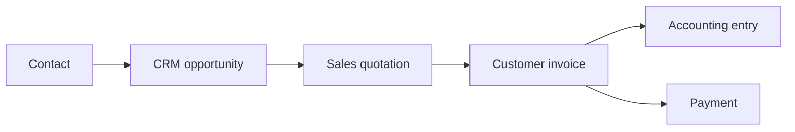

# Connected demo data and form workflows

Formcraft includes a controlled, Nepal-oriented demonstration workspace for testing the connected application without silently placing fictional records into a real workspace.

## Data safety

The demo data is **fictional**. Names, businesses, tax identifiers, messages, invoices, payroll values, inventory transactions, and payments are synthetic examples created solely for product testing.

Safeguards:

- Demo data never loads automatically.
- Only a workspace owner or administrator can load, rebuild, or remove it.
- Existing records without `demoData: true` are retained.
- Rebuilding first removes only the previous demo batch.
- Reset removes only marked demo records.
- Every generated record stores `demoData`, `demoBatchId`, audit entries, comments, and activities.
- A manifest and integrity audit run after generation.
- The interface permanently identifies the records as fictional.

The controls are available under **Demo data** in the stable sidebar and account menu.

## Coverage contract

The generator creates at least **20 records** for every metadata-driven ERP module, every native workspace section, and every supporting operational collection.

Native sections include projects, tasks, team, activity, calendar events, messages, files, and invoices. Supporting collections include warehouses, stock moves, vendor bills, assets, budgets, price lists, lots, and bills of materials.

Every generated ERP record includes two comments, one activity, two audit entries, followers, tags, company and branch context, varied statuses, and valid schema relations where applicable.

## Cross-module effects

The Data Lab creates explicit impact edges so a user can see which source record changed which target record, why it changed, when it changed, and the monetary effect.

The implemented chains are:

1. Lead to cash: Contact → CRM → Sales → Invoice → Accounting → Payment.
2. Procure to pay: Supplier → Purchase → Stock move → Vendor bill → Accounting → Payment.
3. Project to invoice: Project → Task → Timesheet and expense → Invoice → Report.
4. Employee to payroll: Employee → Attendance and leave → Payroll → Accounting and payment.
5. Ticket to resolution: Contact → Helpdesk → Task → Timesheet → Invoice.
6. Plan to produce: Product → Manufacturing → Quality → Stock move → Inventory.

## Form workflow improvements

### Unsaved work and draft recovery

Dirty forms are automatically stored as a browser draft. Closing a dirty form requires confirmation. Explicit **Save draft** closes the form while retaining a recoverable draft for seven days.

### Better validation

Each invalid field receives a specific message, `aria-invalid`, and an entry in the form-level error summary. Focus moves to the first invalid field.

### Automatic calculations and financial review

Supported forms calculate subtotal, discount, taxable amount, tax, and total from quantity and unit price or cost. The total becomes read-only. Financial modules show a review panel before final submission.

### Searchable relations

Large customer, product, employee, member, and project selectors receive search fields with ready, loading, empty, and error states.

### Module-specific sections

Sales, Purchase, Accounting, Payments, Expenses, Inventory, Employees, Payroll, and Helpdesk have designed form sections. Remaining modules are grouped automatically into Basics, Schedule and status, Commercial values, Ownership, and Notes.

### Nepal and mobile inputs

Money and decimal fields use decimal keyboards. Quantity fields use numeric keyboards. Email, telephone, and URL controls receive appropriate autocomplete. Date controls display AD and BS helper text when the Nepal date runtime is available.

### Additional save actions

Create forms support **Save draft**, **Save & add another**, and the normal Create action. Financial records require review before saving.

### Admin configuration

Workspace owners and administrators can safely hide optional fields, reorder fields, restore the default layout, and review aggregate form analytics. Required fields cannot be hidden. Arbitrary code or CSS injection is not supported.

### Product analytics

The system records aggregate opens, successful saves, abandons, validation failures, average completion time, and completion rate by module. These metrics are intended for product improvement rather than employee surveillance.

## Test matrix

The release pipeline verifies:

- at least 20 records in every ERP module;
- at least 20 records in every native and supporting collection;
- comments and activities for every generated ERP record;
- valid schema relationships and impact edges;
- safe reset without deleting real records;
- Data Lab desktop and mobile layouts;
- unsaved-change confirmation and draft recovery;
- field-specific validation;
- searchable relationships;
- automatic financial calculations and review;
- admin field visibility and ordering;
- mobile input modes and AD/BS helpers;
- existing ERP, project, invoice, calendar, navigation, theme, and responsive regressions; and
- browser console and runtime errors.

CI captures desktop and mobile screenshots of the Data Lab and Sales Order form. The files are uploaded as the `demo-data-visual-snapshots` workflow artifact for visual review alongside geometry and interaction checks.

## Using the Data Lab

1. Sign in as a workspace owner or administrator.
2. Open **Demo data** from the stable sidebar.
3. Select **Load connected demo dataset**.
4. Confirm the action.
5. Review coverage and workflow effects.
6. Open workflow steps or recent effects to inspect linked records.
7. Export the manifest when evidence is needed.
8. Use **Remove demo data** to remove only generated records.

No local CLI, package installation, or database command is required.
